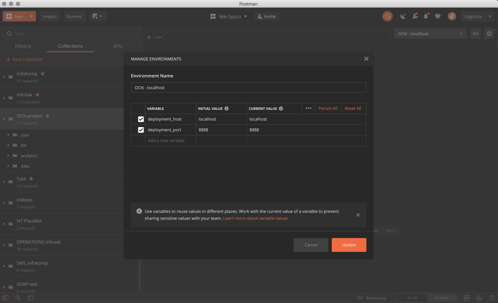

# Development

## Prerequisites
You should have:
* docker
* docker-compose
* makefile
* [postman](https://www.postman.com/)
* firebase credentials

`!NB for frontend development`   

Credentials must lie down in `/src/.env.development`. There is example in `example-env`.

`!!!!` It is **IMPORTANT** do not commit credentials.   

### How to run db and backend
Execute from project's root

| command       | description   | 
|:------------- |:-------------| 
| make run      | up database, wait 10 secs, up backend | 
| make status   | show status                     | 
| make stop     | stop db and backend, save state | 

`make run`

`!NB` check Makefile for full set of commands.

`!NB` check docker-compose.yml file for additional info.

### Postman collection
* Open postman and import [postman collection](https://www.getpostman.com/collections/773a9544c72bb200bf09)
* Create env 
 

### Interact with backend system
Postman collection is collection of requests to communicate with backend system.
Backend system is REST application.

`GET`     -> fetch   
`POST`    -> create  
`PUT`     -> update(implemented with replace, idempotent)

When first run you need to create at least one user, that you can assign list to that user.
Folders `list`, `user` and `analytics` are to interact with system.
Folder data contains request for development.  

## Frontend development
When database and backend up and running, execute 
`yarn run serve` and continue developing with hot-reload feature.

